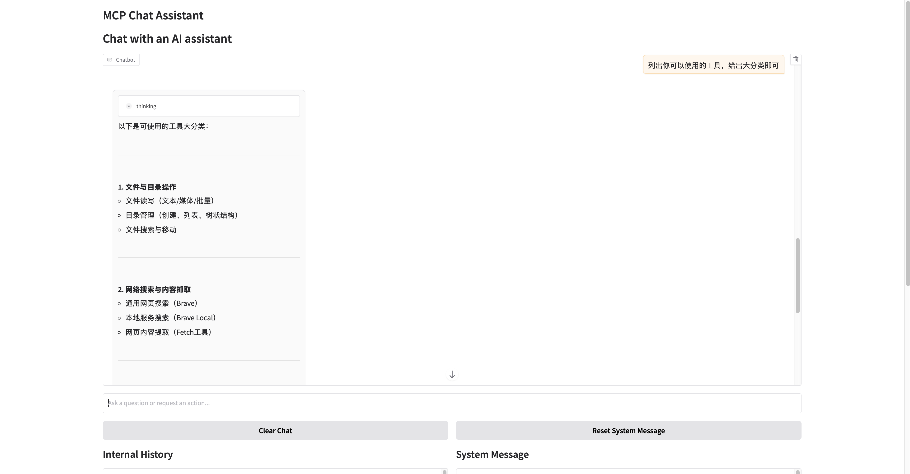
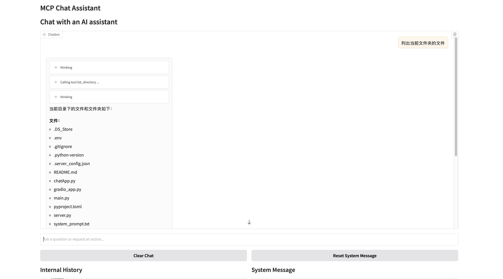
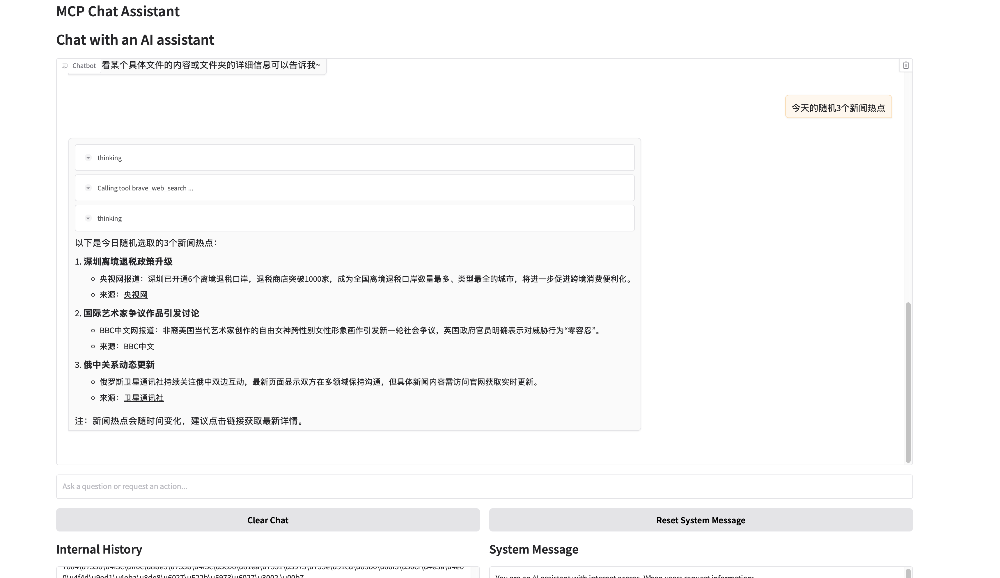
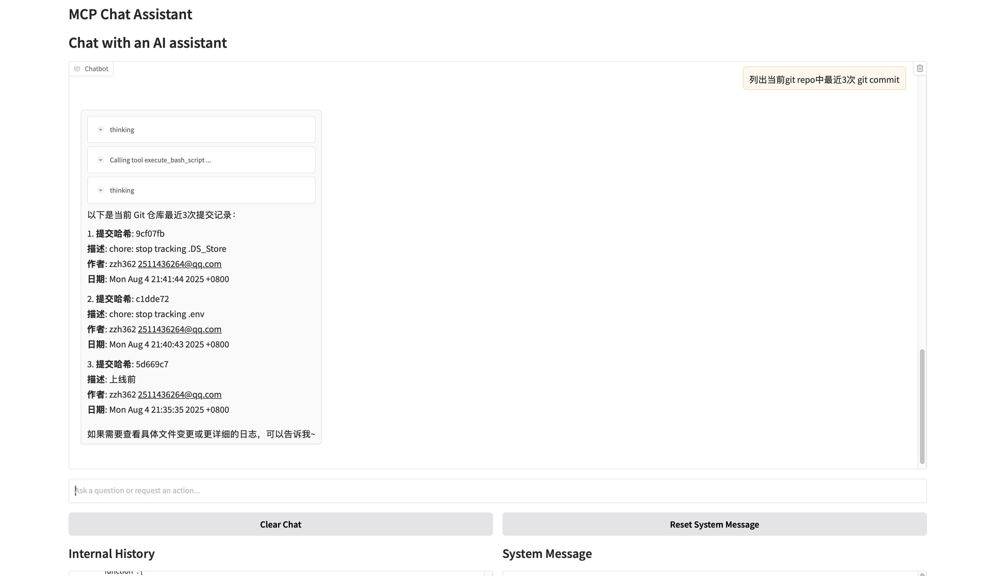
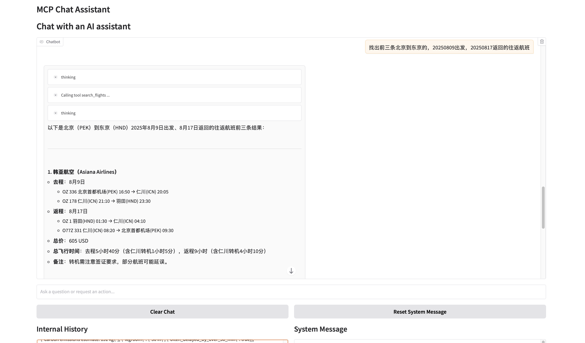
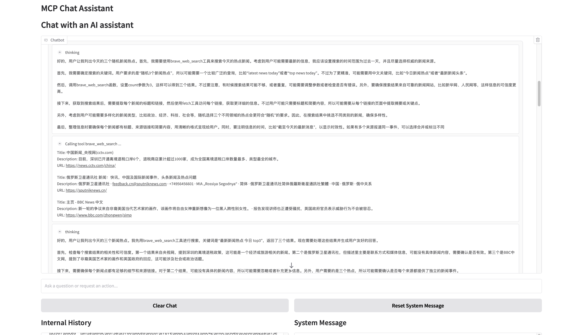

# MCP-Agent Orchestrator（基于 MCP 的多工具智能体调度平台）
## 项目简介：
基于 Model Context Protocol (MCP) 从零搭建可扩展的本地 Chat Agent，集成大模型推理、工具调用与 Web 前端交互能力，实现标准化工具接入和多轮对话链路，探索大模型在自动化应用中的工程化落地。

## 项目背景：
传统的大模型工具调用需针对每个 API 实现独立适配层，开发成本高、复用性差。MCP 作为开放协议，提供统一的工具注册与调用标准，本项目围绕 MCP 协议实现了一个支持深度推理、多工具调度及可视化交互的本地智能 Agent。

## MCP 工具链集成

接入并管理多个 MCP Server，包括：
1. 文件系统 (FileSystem)：本地文件遍历、读写、搜索
2. 联网检索 (Brave Search)：外部知识实时检索
3. 代码执行器 (Python/Bash)：安全沙箱下的动态代码执行
4. 航班查询工具：基于 SerpAPI 的航班检索与 JSON 解析

### 使用示例
1. 文件系统

2. 联网检索

3. 代码执行器

4. 航班查询工具

### 思考及调用过程可视化

## 使用手册
### 环境激活
source .venv/bin/activate

### 运行
uv run chatApp.py

### web前端
uv run gradio_app.py

### mcp工具测试
mcp dev ./server/google_flights/google_flights.py